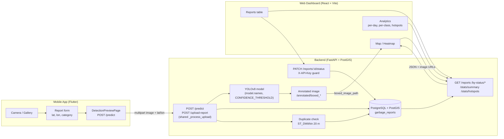

# System Architecture

## Components

- **Mobile (Flutter):** capture → `POST /predict` → boxed image + class → history/map. Base URL via `--dart-define=API_BASE_URL`.
- **Backend (FastAPI):** single `_process_upload` serves `/predict` and `/upload-report`; YOLO inference with one tunable `CONFIDENCE_THRESHOLD`; PostGIS duplicate check (~20 m, same class) + severity score (1–5).
- **Database (PostgreSQL + PostGIS):** `garbage_reports` table managed by Alembic (`backend-database/alembic/`).
- **Dashboard (React):** `VITE_API_URL` for backend; admin login stores `X-API-Key` for status updates; Analytics reads `/reports/stats/*`.
